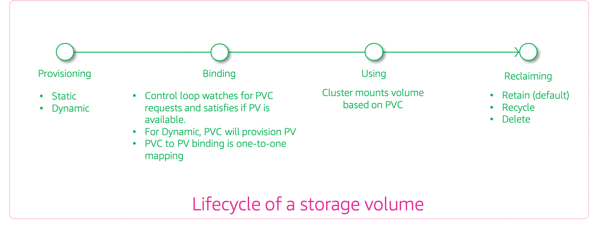
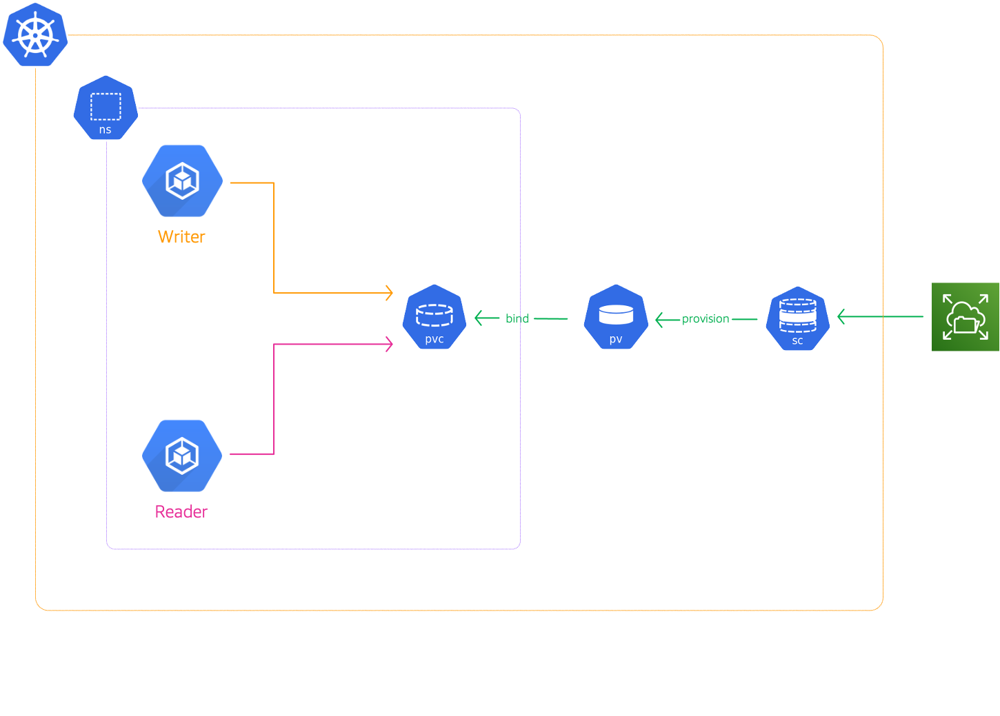

# Kubernetes(EKS) Persistent Storage With EFS Amazon Service

The developer at Mystique Unicorn are interested in building their application using event-driven architectural pattern to process streaming data. For those who are unfamiliar, _An event-driven architecture uses events to trigger and communicate between decoupled services and is common in modern applications built with microservices. An event is a change in state, or an update, like an item being placed in a shopping cart on an e-commerce website._

In this application, Kubernetes has been chosen as the platform to host their application producing and consuming events. Some of the consumers have to share their state between them. They would like to have persistent storage accessible to their pods in kubernetes. Can you help them achieve this?

## 🎯 Solutions

**Amazon Elastic File System:** Amazon EFS<sup>[2]</sup> lets you share file data without provisioning or managing storage and can be used with AWS Cloud services. With Amazon EFS, you can grow and shrink your file systems automatically as you add and remove files, eliminating the need to provision and manage capacity to accommodate growth. The Amazon EFS Container Storage Interface (CSI)<sup>[3]</sup> driver provides a CSI interface that allows Kubernetes clusters running on AWS to manage the lifecycle of Amazon EFS file systems.

**Kubernetes Persistent storage Overview**



- **Persistent volume claims(PVCs):**
  Managing storage is a distinct problem from managing compute instances. The _PersistentVolume_ subsystem provides an API for users and administrators that abstracts details of how storage is provided from how it is consumed. Cluster administrators can use Kubernetes persistent volume (PV)<sup>[1]</sup> to provision persistent storage for a cluster. Developers can use persistent volume claims (PVCs) to request PV resources without having specific knowledge of the underlying storage infrastructure.

  PVCs are specific to a namespace, and are created and used by developers as a means to use a PV. After a PV is bound to a PVC, that PV can not then be bound to additional PVCs. This has the effect of scoping a bound PV to a single namespace.

  When you create a PVC, you request a specific _amount of storage_, also specify the required _access mode_, and create a _storage class_ to describe and classify the storage.

- **Use Pods and claimed PVs**
  Pods use _claims_ as volumes. The cluster inspects the claim to find the bound volume and mounts that volume for a Pod. For those volumes that support multiple access modes, you must specify which mode applies when you use the claim as a volume in a Pod.

  Once you have a claim and that claim is bound, the bound PV belongs to you for as long as you need it. You can schedule Pods and access claimed PVs by including `persistentVolumeClaim` in the Pod’s volumes block.

In this blog, I will show how to deploy EFS with application specific access points and statically bind them for pod usage.



1. ## 🧰 Prerequisites

   This demo, instructions, scripts and cloudformation template is designed to be run in `us-east-1`. With few modifications you can try it out in other regions as well(_Not covered here_).

   - 🛠 AWS CLI Installed & Configured - [Get help here](https://youtu.be/TPyyfmQte0U)
   - 🛠 AWS CDK Installed & Configured - [Get help here](https://www.youtube.com/watch?v=MKwxpszw0Rc)
   - 🛠 Python Packages, _Change the below commands to suit your OS, the following is written for amzn linux 2_
     - Python3 - `yum install -y python3`
     - Python Pip - `yum install -y python-pip`
     - Virtualenv - `pip3 install virtualenv`

1. ## ⚙️ Setting up the environment

   - Get the application code

     ```bash
     git clone https://github.com/miztiik/eks-persistent-storage-with-efs
     cd eks-persistent-storage-with-efs
     ```

1. ## 🚀 Prepare the dev environment to run AWS CDK

   We will use `cdk` to make our deployments easier. Lets go ahead and install the necessary components.

   ```bash
   # You should have npm pre-installed
   # If you DONT have cdk installed
   npm install -g aws-cdk

   # Make sure you in root directory
   python3 -m venv .venv
   source .venv/bin/activate
   pip3 install -r requirements.txt
   ```

   The very first time you deploy an AWS CDK app into an environment _(account/region)_, you’ll need to install a `bootstrap stack`, Otherwise just go ahead and deploy using `cdk deploy`.

   ```bash
   cdk bootstrap
   cdk ls
   # Follow on screen prompts
   ```

   You should see an output of the available stacks,

   ```bash
   eks-cluster-vpc-stack
   eks-cluster-stack
   ssm-agent-installer-daemonset-stack
   efs-stack
   ```

1. ## 🚀 Deploying the application

   Let us walk through each of the stacks,

   - **Stack: eks-cluster-vpc-stack**
     To host our EKS cluster we need a custom VPC. This stack will build a multi-az VPC with the following attributes,

     - **VPC**:
       - 2-AZ Subnets with Public, Private and Isolated Subnets.
       - 1 NAT GW for internet access from private subnets

     Initiate the deployment with the following command,

     ```bash
     cdk deploy eks-cluster-vpc-stack
     ```

     After successfully deploying the stack, Check the `Outputs` section of the stack for the

   - **Stack: eks-cluster-stack**
     As we are starting out a new cluster, we will use most default. No logging is configured or any add-ons. The cluster will have the following attributes,

     - The control pane is launched with public access. _i.e_ the cluster can be access without a bastion host
     - `c_admin` IAM role added to _aws-auth_ configMap to administer the cluster from CLI.
     - One **OnDemand** managed EC2 node group created from a launch template
       - It create two `m5.large` instances running `Amazon Linux 2`.
       - Auto-scaling Group with `2` desired instances.
       - The nodes will have a node role attached to them with `AmazonSSMManagedInstanceCore` permissions
       - Kubernetes label `app:miztiik_on_demand_ng`

     The EKS cluster will be created in the custom VPC created earlier. Initiate the deployment with the following command,

     ```bash
     cdk deploy eks-cluster-stack
     ```

     After successfully deploying the stack, Check the `Outputs` section of the stack. You will find the `**ConfigCommand**` that allows yous to interact with your cluster using `kubectl`

   - **Stack: ssm-agent-installer-daemonset-stack**
     This EKS AMI used in this stack does not include the AWS SSM Agent out of the box. If we ever want to patch or run something remotely on our EKS nodes, this agent is really helpful to automate those tasks. We will deploy a daemonset that will _run exactly once?_ on each node using a cron entry injection that deletes itself after successful execution. If you are interested take a look at the daemonset manifest here `stacks/back_end/eks_cluster_stacks/eks_ssm_daemonset_stack/eks_ssm_daemonset_stack.py`. This is inspired by this AWS guidance.

     Initiate the deployment with the following command,

     ```bash
     cdk deploy ssm-agent-installer-daemonset-stack
     ```

     After successfully deploying the stack, You can connect to the worker nodes instance using SSM Session Manager.

   - **Stack: efs-stack**

     This stack will create the Amazon EFS. There are few resources that are prerequisites to create the EFS share. This stack will create the following resources,

     - EFS filesystem on the vpc created by the `eks-cluster-vpc-stack`
     - EFS mount points on the public subnets,as our pods will be running there
     - Security group for our EFS share allowing inbound `TCP` on ort `2049` from our VPC CIDR range
     - Posix user & acl `1000` - _In case you want to use OS level access restrictions, these will come in handy_
     - EFS Access Point to make it easier to mount to Lambda and apply resource level access restrictions
       - The default path for the access point is set to `/efs`

     Initiate the deployment with the following command,

     ```bash
     cdk deploy efs-stack
     ```

     After successfully deploying the stack, Check the `Outputs` section of the stack. You will find the `EFSFileSystemId` and the `EFSAccessPointId`. We will use these values during the testing phase.

1. ## 🔬 Testing the solution

   Now we have completed all the prerequisites to deploy pods to use our EFS. We need to use three Kubernetes settings to mount EFS on EKS. Those are `StorageClass`, `PersistentVolume` (PV), and `PersistentVolumeClaim` (PVC). To configure the `StorageClass` we need to install the EFS CSI drivers.

   The manifests used in the following sections are under this directory `stacks/k8s_utils/manifests`

   1. **Install EFS CSI Driver**

      You can use install the Amazon EFS CSI driver using Helm or a manifest, Here we are using the manifest. You may want to check the version of release to match the latest version. As of writing this blog, `1.3` is the latest.

      ```bash
      kubectl kustomize "github.com/kubernetes-sigs/aws-efs-csi-driver/deploy/kubernetes/overlays/stable/ecr?ref=release-1.3" > efs-csi-driver.yaml
      kubectl apply -f efs-csi-driver.yaml
      ```

      You may get a warning about `beta` api, you can ignore that for now.

      Confirm the pods have been deployed:

      ```bash
      kubectl get pods -n kube-system
      ```

      Expected output,

      ```bash
      NAME                                 READY   STATUS    RESTARTS   AGE
      ...
      efs-csi-controller-979887ccb-d56c4   3/3     Running   0          7m4s
      efs-csi-controller-979887ccb-drgzp   3/3     Running   0          7m4s
      efs-csi-node-6xm8r                   3/3     Running   0          7m4s
      efs-csi-node-z8mwf                   3/3     Running   0          7m4s
      ...
      ```

   1. **Create Storage Class**

      We need to define the storage classes in our Kubernetes cluster,

      ```bash
      kubectl apply -f efs-storageclass.yml
      ```

      Confirm the storage class:

      ```bash
      kubectl get storageclass
      ```

      Expected output,

      ```bash
      NAME            PROVISIONER             RECLAIMPOLICY   VOLUMEBINDINGMODE      ALLOWVOLUMEEXPANSION   AGE
      efs-sc          efs.csi.aws.com         Delete          Immediate              false                  22m
      gp2 (default)   kubernetes.io/aws-ebs   Delete          WaitForFirstConsumer   false                  4h2m
      ```

      You can also describe the efs storage class to learn more about it,

      ```bash
      kubectl describe storageclass efs-sc
      ```

      Output,

      ```bash
      Name:            efs-sc
      IsDefaultClass:  No
      Annotations:     kubectl.kubernetes.io/last-applied-configuration={"apiVersion":"storage.k8s.io/v1","kind":"StorageClass","metadata":{"annotations":{},"name":"efs-sc"},"provisioner":"efs.csi.aws.com"}

      Provisioner:           efs.csi.aws.com
      Parameters:            <none>
      AllowVolumeExpansion:  <unset>
      MountOptions:          <none>
      ReclaimPolicy:         Delete
      VolumeBindingMode:     Immediate
      Events:                <none>
      ```

   1. **Create Namespace**

      As network policies are namespaced resources, let us begin by creating a new namespace.

      ```bash
      kubectl apply -f miztiik-automation-ns.yml
      ```

   1. **Create Persistent Volume**

      Let us create two persistent volume. The manifest is provided in the directory `stacks/k8s_utils/manifests`. You will need to customize the values for the `volumeHandle`. The value takes the format `EFS_FS_ID::FS_ACCESS_POINT_ID`. These can be found in the outputs section of the stack `efs-stack`.

      ```text
      apiVersion: v1
      kind: PersistentVolume
      metadata:
      name: efs-pv
      spec:
      capacity:
         storage: 5Gi
      volumeMode: Filesystem
      accessModes:
         - ReadWriteMany
      persistentVolumeReclaimPolicy: Retain
      storageClassName: efs-sc
      csi:
         driver: efs.csi.aws.com
         volumeHandle: fs-29f1461d::fsap-061e2291a97026a9b
      ```

      Deploy the policy `red-ingress-aws-security-policy.yml`

      ```bash
      manifests]# kubectl apply -f efs-persistentvolume.yml
      persistentvolume/efs-pv created
      ```

   1. **Create Persistent Volume Claim**

      Let us create two persistent volume claim. The manifest is provided in the directory `stacks/k8s_utils/manifests`. Note that the claim is bounded to the namespace we create earlier.

      ```text
      apiVersion: v1
      kind: PersistentVolumeClaim
      metadata:
      name: efs-storage-claim
      namespace: miztiik-automation-ns
      spec:
      accessModes:
         - ReadWriteMany
      storageClassName: efs-sc
      resources:
         requests:
            storage: 5Gi
      ```

      Deploy the persistent volume claim,

      ```bash
      manifests]# kubectl apply -f efs-persistentvolume-claim.yml
      persistentvolumeclaim/efs-storage-claim created
      ```

      Confirm that a persistent volume was created with a status of `Bound` to a `PersistentVolumeClaim`:

      ```bash
      kubectl get pv
      ```

      Expected output,

      ```bash
      NAME     CAPACITY   ACCESS MODES   RECLAIM POLICY   STATUS   CLAIM                                     STORAGECLASS   REASON   AGE
      efs-pv   5Gi        RWX            Retain           Bound    miztiik-automation-ns/efs-storage-claim   efs-sc                  8m12s
      ```

      Don't proceed to the next step until the **STATUS** is `Bound`.

      Let us find out more details about our volume,

      ```bash
      manifests]# kubectl describe pv
      Name:            efs-pv
      Labels:          <none>
      Annotations:     pv.kubernetes.io/bound-by-controller: yes
      Finalizers:      [kubernetes.io/pv-protection]
      StorageClass:    efs-sc
      Status:          Bound
      Claim:           miztiik-automation-ns/efs-storage-claim
      Reclaim Policy:  Retain
      Access Modes:    RWX
      VolumeMode:      Filesystem
      Capacity:        5Gi
      Node Affinity:   <none>
      Message:
      Source:
         Type:              CSI (a Container Storage Interface (CSI) volume source)
         Driver:            efs.csi.aws.com
         FSType:
         VolumeHandle:      fs-29f1461d::fsap-061e2291a97026a9b
         ReadOnly:          false
         VolumeAttributes:  <none>
      Events:               <none>
      ```

   1. **Deploy Pods**

      We will create two pods,

      - pod name: `k-shop-writer` with label `role:writer`
      - pod name: `k-shop-reader` with label `role:reader`

      ```bash
      kubectl create -f pod_writer.yml
      kubectl create -f pod_reader.yml
      ```

      Confirm pods are running and wait for the `k-shop-writer` and `k-shop-reader` pods **STATUS** to become **Running**. It may take a few minutes for the pods to reach the _Running_ status.

      ```bash
      kubectl get pods -o wide -n miztiik-automation-ns
      ```

      Expected output,

      ```bash
      NAME          READY   STATUS    RESTARTS   AGE   IP            NODE                                        NOMINATED NODE   READINESS GATES
      k-shop-blue   1/1     Running   0          62s   10.10.1.74    ip-10-10-1-102.eu-west-1.compute.internal   <none>           <none>
      k-shop-red    1/1     Running   0          66s   10.10.0.118   ip-10-10-0-160.eu-west-1.compute.internal   <none>           <none>
      ```

   1. **Connect to Reader Pod To Test EFS**

      Connect to the Reader pod and try to access EFS,

      ```bash
      kubectl -n miztiik-automation-ns exec --stdin --tty k-shop-reader -- sh
      ```

      You should land in the container shell, you can use navigate to `/shared/` and look for `out.txt` or use `tail` command.

      Expected output,

      ```bash
      tail -f /shared/out.txt
      miztiik engineering from: k-shop-writer.miztiik-automation-ns - Sun Jul 4 15:13:55 UTC 2021
      miztiik engineering from: k-shop-writer.miztiik-automation-ns - Sun Jul 4 15:14:00 UTC 2021
      miztiik engineering from: k-shop-writer.miztiik-automation-ns - Sun Jul 4 15:14:05 UTC 2021
      miztiik engineering from: k-shop-writer.miztiik-automation-ns - Sun Jul 4 15:14:10 UTC 2021
      miztiik engineering from: k-shop-writer.miztiik-automation-ns - Sun Jul 4 15:14:15 UTC 2021
      miztiik engineering from: k-shop-writer.miztiik-automation-ns - Sun Jul 4 15:14:20 UTC 2021
      miztiik engineering from: k-shop-writer.miztiik-automation-ns - Sun Jul 4 15:14:25 UTC 2021
      miztiik engineering from: k-shop-writer.miztiik-automation-ns - Sun Jul 4 15:14:30 UTC 2021
      miztiik engineering from: k-shop-writer.miztiik-automation-ns - Sun Jul 4 15:14:35 UTC 2021
      miztiik engineering from: k-shop-writer.miztiik-automation-ns - Sun Jul 4 15:14:40 UTC 2021
      miztiik engineering from: k-shop-writer.miztiik-automation-ns - Sun Jul 4 15:14:45 UTC 2021
      ```

1. ## 📒 Conclusion

   Here we have demonstrated how to use EFS to share data between pods. You can extend this feature by restricting the pods access using a dedicated service account.

1. ## 🧹 CleanUp

   If you want to destroy all the resources created by the stack, Execute the below command to delete the stack, or _you can delete the stack from console as well_

   - Resources created during [Deploying The Application](#-deploying-the-application)
   - Delete CloudWatch Lambda LogGroups
   - _Any other custom resources, you have created for this demo_

   ```bash
   # Delete from cdk
   cdk destroy

   # Follow any on-screen prompts

   # Delete the CF Stack, If you used cloudformation to deploy the stack.
   aws cloudformation delete-stack \
     --stack-name "MiztiikAutomationStack" \
     --region "${AWS_REGION}"
   ```

   This is not an exhaustive list, please carry out other necessary steps as maybe applicable to your needs.

## 📌 Who is using this

This repository aims to show how to use EFS along with EKS for persistent storage to secure AWS EKS to new developers, Solution Architects & Ops Engineers in AWS. Based on that knowledge these Udemy [course #1][102], [course #2][101] helps you build complete architecture in AWS.

### 💡 Help/Suggestions or 🐛 Bugs

Thank you for your interest in contributing to our project. Whether it is a bug report, new feature, correction, or additional documentation or solutions, we greatly value feedback and contributions from our community. [Start here](/issues)

### 👋 Buy me a coffee

[](https://ko-fi.com/Q5Q41QDGK) Buy me a [coffee ☕][900].

### 📚 References

1. [Kubernetes Docs: Persistent Volumes][1]
1. [AWS Docs: EFS][2]
1. [AWS Docs: EFS CSI Driver][3]

### 🏷️ Metadata


**Level**: 200

[1]: https://kubernetes.io/docs/concepts/storage/persistent-volumes/
[2]: https://aws.amazon.com/efs/
[3]: https://docs.aws.amazon.com/eks/latest/userguide/efs-csi.html
[100]: https://www.udemy.com/course/aws-cloud-security/?referralCode=B7F1B6C78B45ADAF77A9
[101]: https://www.udemy.com/course/aws-cloud-security-proactive-way/?referralCode=71DC542AD4481309A441
[102]: https://www.udemy.com/course/aws-cloud-development-kit-from-beginner-to-professional/?referralCode=E15D7FB64E417C547579
[103]: https://www.udemy.com/course/aws-cloudformation-basics?referralCode=93AD3B1530BC871093D6
[899]: https://www.udemy.com/user/n-kumar/
[900]: https://ko-fi.com/miztiik
[901]: https://ko-fi.com/Q5Q41QDGK
